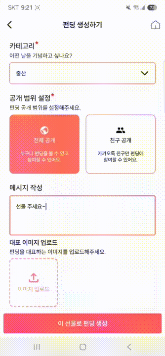
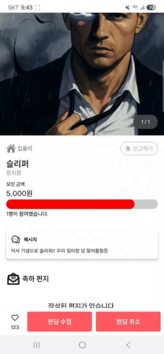
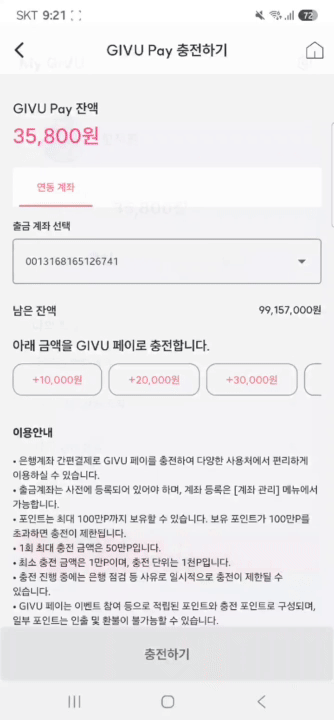
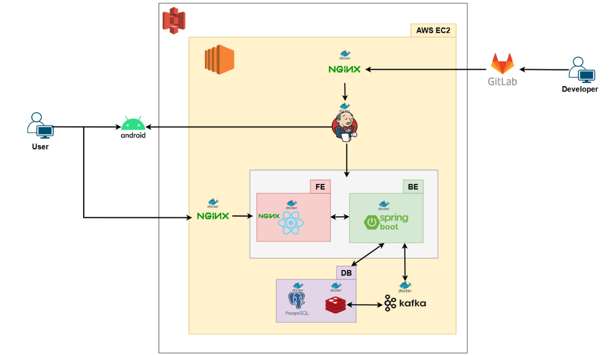
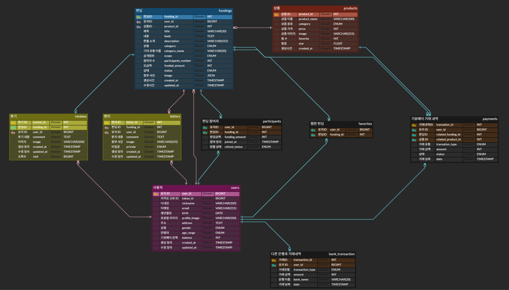

# :gift: GIVU(기뷰)

> "GIVU : 나를 위한 크라우드 펀딩"
>

### 🎁 기획 배경

생일, 기념일, 입사 축하처럼 **여러 사람이 함께 선물을 준비하는 순간**은 많지만, 실제로는 다음과 같은 문제들이 존재합니다:

- **낮은 실용성**: 선물 받는 사람이 원하지 않는 저가형 선물이 종종 선택됨
- **모금의 번거로움**: 돈을 모으고 관리하는 과정에서 불필요한 커뮤니케이션과 스트레스 발생
- **신뢰 문제**: 모금 주체에 대한 신뢰 부족, 정산 투명성 문제

기존의 ‘카카오톡 선물하기’와 같은 서비스는 **1:1 또는 낮은 금액의 개인화되지 않은 선물**에 초점이 맞춰져 있어, 위 문제들을 해결하기 어려운 구조입니다.

**GIVU**는 이런 상황에서 착안해,

**소액의 선물보다, 진짜 갖고 싶은 선물을 여럿이 함께 만들어주는 경험**을 중심으로 기획되었습니다.

## 🌟 서비스 가치

### **원하는 선물을 직접 제안하고, 함께 모금**

받고 싶은 선물을 직접 설정하고, 친구들과 공유하면,

**여러 사람이 쉽게 돈을 모아 하나의 선물을 완성할 수 있는** 구조를 제공합니다.

### **작은 돈, 큰 선물**

작은 금액으로는 의미 없는 선물이 될 수 있지만,

**모이면 가치 있는 선물**이 될 수 있습니다.

GIVU는 **모두가 기여한 만큼 감동을 전할 수 있는 새로운 방식의 선물 문화**를 만듭니다.

### **모임 기반 소셜 경험 강화**

단순한 ‘선물하기’를 넘어서,

**기부 + 리워드 + 공유 감성**을 결합한 새로운 형태의 **경험 중심 선물 플랫폼**으로 진화할 수 있습니다.

&nbsp;

## 📒 주요 기능
### 1. 펀딩 참여
#### Web
  

    
    
  

#### App
  

    
  

### 2. 펀딩 생성
#### Web
  

    
  

#### App
  

    
    
  

### 3. 펀딩 취소
#### Web
  

    
  

#### App
  

    
  

### 4. GIVU Pay
#### App
  

    
  

### 5. GIVU Mall
#### Web
  

    
  

#### App
  

    
  

### 6. 상품 주문
#### Web
  

    
  

### 7. 부가 기능
#### Web
  

    
  

&nbsp;

## ⚒ 기술 스택

### Android

**MVVM, Mutli-Module, DI(Hilt)**

### Front-End

### Back-End

**JPA, Lombok, BatchJob**

### DB

### INFRA

### 협업 및 관리 도구

&nbsp;

## 📂 프로젝트 구조
### 시스템 아키텍처

    
  

### ER Diagram

    
  

&nbsp;

## 👨‍👩‍👧‍👦 팀원 정보

|                                                                      장홍준                                                                      |                                                                    박민수                                                                     |                                                                       신은찬                                                                       |                                                                         이문경                                                                         |                                                                    정도현                                                                    |                                                                       정지원                                                                       |
|:---------------------------------------------------------------------------------------------------------------------------------------------:|:------------------------------------------------------------------------------------------------------------------------------------------:|:-----------------------------------------------------------------------------------------------------------------------------------------------:|:---------------------------------------------------------------------------------------------------------------------------------------------------:|:-----------------------------------------------------------------------------------------------------------------------------------------:|:-----------------------------------------------------------------------------------------------------------------------------------------------:|
|  |  |  |  |  |  |
|                                                                   팀장, 안드로이드                                                                   |                                                                    프론트엔드                                                                     |                                                                      프론트엔드                                                                      |                                          백엔드/인프라                                                                         |                                                                    백엔드                                                                    |                                                                      안드로이드                                                                      |

&nbsp;

## 📌 기타 정보

